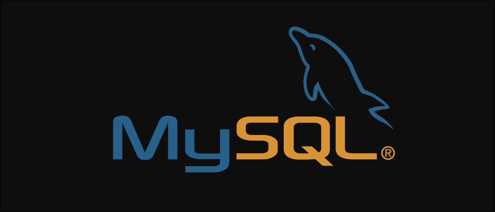

# SqlStatements

## PRÁCTICA DE SENTENCIAS SQL.
Este repositorio contiene ejercicios y prácticas relacionados con el lenguaje SQL utilizando MySQL. El objetivo es familiarizarse y practicar con las sentencias SQL básicas, como CREATE, INSERT, UPDATE, SELECT, y más.

## Contenido

El repositorio se organiza de los siguientes ficheros:

- **`01-create tables.sql`**: En este archivo, encontrarás ejemplos de cómo crear tablas en una base de datos utilizando la sentencia `CREATE TABLE`.

- **`02-insert values.sql`**: Aquí se proporcionan ejemplos de cómo insertar datos en tablas utilizando la sentencia `INSERT INTO`.

- **`03-update.sql`**: Se presentan ejemplos de cómo actualizar datos en una tabla utilizando la sentencia `UPDATE`.

- **`04-select.sql`**: En este archivo, se incluyen ejemplos de cómo consultar datos de una tabla utilizando la sentencia `SELECT`. También se pueden encontrar ejemplos de uso de cláusulas como `WHERE`, `BETWHEN`, `GROUP BY`, y más.

## Uso

Puedes clonar este repositorio y usar los archivos SQL de ejemplo para practicar y aprender SQL. Cada archivo contiene breves explicaciones y ejemplos de las sentencias SQL correspondientes que se realiza.

## Recursos Adicionales

Si deseas aprender más sobre SQL y MySQL, aquí tienes algunos recursos adicionales útiles:

- [Documentación oficial de MySQL](https://dev.mysql.com/doc/)

- [SQL Tutorial de W3Schools](https://www.w3schools.com/sql/)

- [Curso de SQL en Codecademy](https://www.codecademy.com/learn/learn-sql)

